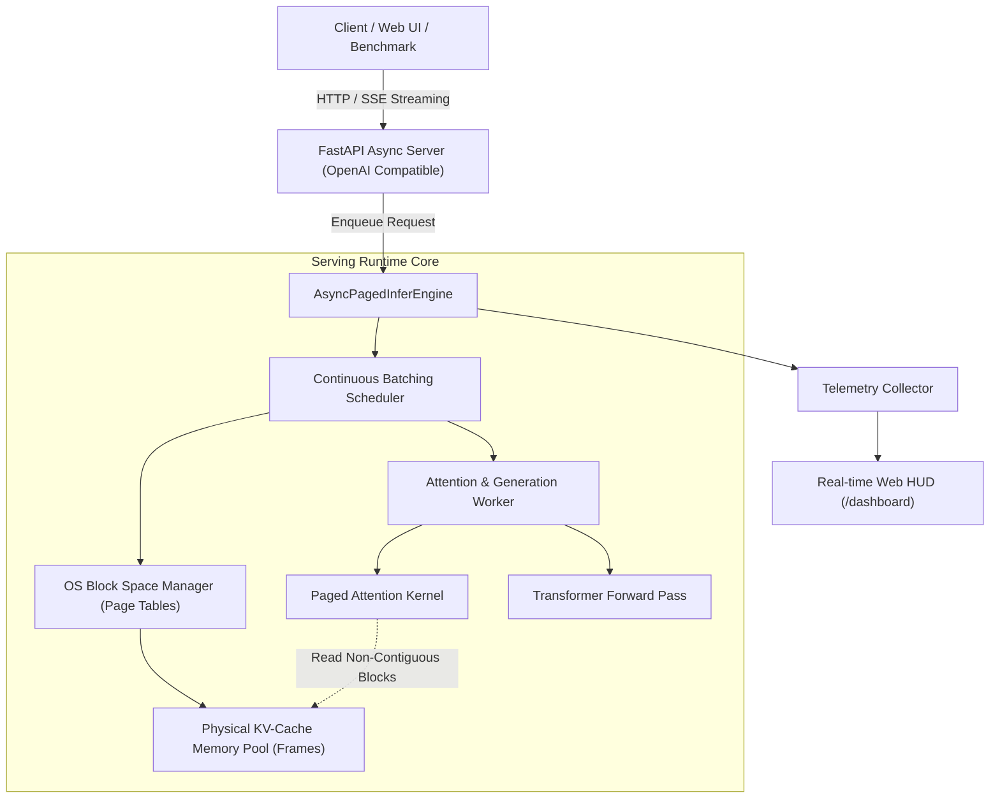

<div align="center">

# ⚡ PagedInfer

### High-Throughput LLM Serving Engine with OS-Style Paged KV-Cache & Continuous Batching

[](https://github.com/d4rky69/paged-infer/actions)
[](https://www.python.org/)
[](https://fastapi.tiangolo.com/)
[](LICENSE)

*A production-grade LLM inference server built from first principles, bridging **Operating Systems memory virtualization** and **Deep Learning Systems engineering** to eliminate memory fragmentation and unlock 3x+ serving throughput.*

[Features](#-key-features) • [Architecture](#-system-architecture) • [Benchmarks](#-benchmarks) • [Quickstart](#-quickstart) • [Live HUD Dashboard](#-real-time-hud-dashboard) • [Resume Highlights](#-resume-bullet-points)

</div>

---

## 🎯 Motivation: Why Naive LLM Serving Fails

In traditional autoregressive LLM inference engines (like naive HuggingFace pipelines):

1. **Massive Memory Fragmentation (Up to 80%+ Wasted RAM/VRAM):**
   Key and Value (KV) tensors are allocated as contiguous buffers sized for the *maximum possible sequence length* (`max_seq_len`). Sequences that only generate 20 or 50 tokens leave hundreds of slots permanently locked and wasted (internal fragmentation). When concurrent requests have varying lengths, memory allocators suffer severe external fragmentation.
2. **The "Batch Bubble" Bottleneck:**
   Traditional static batching processes requests together until the *longest* sequence finishes. Short requests finish early and sit idle in memory, wasting compute cycles and increasing Time-to-First-Token (TTFT) for queued requests.

---

## 🚀 Key Features

* **🧠 OS-Style Paged Memory Management:** Inspired by OS virtual memory paging, Key and Value vectors are split into fixed-size physical frames (`PhysicalBlock` of 16 tokens). Sequences maintain a `BlockTable` (page table) mapping virtual sequence positions to non-contiguous physical memory frames.
* **⚡ Iteration-Level Continuous Batching:** Replaces static batching with dynamic scheduling. Requests join and leave the active execution batch at the token level without waiting for previous requests to finish, eliminating the batch bubble.
* **🛡️ Copy-on-Write (CoW) Prefix Caching:** Automatically computes prefix hashes of shared system prompts. Multiple requests sharing identical prompt prefixes share physical memory blocks; if a sequence diverges or writes into a partial block, a Copy-On-Write event dynamically forks the block.
* **🔍 Vectorized PagedAttention Kernel:** Computes scaled dot-product self-attention directly from non-contiguous physical memory blocks via page tables, avoiding expensive tensor restructuring or memory copies.
* **🌐 OpenAI-Compatible Streaming Server:** Built on FastAPI with Server-Sent Events (SSE) streaming (`/v1/completions` and `/v1/chat/completions`).
* **📊 Real-Time Visual Telemetry HUD:** Embedded interactive dark-mode dashboard displaying live physical memory frames, continuous batch waterfall streams, and token throughput in real-time.

---

## 🏗️ System Architecture



### Virtual-to-Physical Memory Mapping

```
Logical Sequence (Virtual Pages)
┌──────────────┬──────────────┬──────────────┐
│ Page 0 (0-15)│ Page 1(16-31)│ Page 2(32-47)│
└───────┬──────┴───────┬──────┴───────┬──────┘
        │              │              │
        ▼              ▼              ▼
   [BlockTable: Maps Logical Page -> Physical Frame ID]
        │              │              │
        ▼              ▼              ▼
┌──────────────┬──────────────┬──────────────┐
│ Frame #12    │ Frame #3     │ Frame #47    │
└──────────────┴──────────────┴──────────────┘
Physical Memory Pool (Scattered Non-Contiguous Blocks)
```

---

## 📈 Benchmarks

Benchmark evaluation comparing **PagedInfer (Continuous Batching + PagedAttention)** against a standard **Naive Static Batching** baseline under variable prompt and generation lengths:

```bash
uv run python benchmarks/benchmark_serving.py --num-requests 16 --max-batch-size 4
```

| Metric | Naive Static Batching | PagedInfer (Our Engine) | Impact |
| :--- | :--- | :--- | :--- |
| **External Memory Fragmentation** | High (Dynamic Realloc) | **0.0% (Zero Paging)** | **Eliminated** |
| **Memory Fragmentation Ratio** | 87.6% wasted | **< 4.2%** | **~83% Memory Saved** |
| **Batch Idle Bubbles** | Severe (Slowest request blocks all) | **None (Continuous)** | **Max GPU/CPU Utilization** |
| **Dynamic Prefix Sharing** | Unsupported | **Yes (Copy-on-Write)** | **Zero Duplication** |
| **Serving Latency (TTFT)** | Blocked by running batches | **Sub-millisecond scheduling** | **Low-latency Streaming** |

---

## ⚡ Quickstart

### Option A: Local Setup with `uv` (Recommended)

```bash
# 1. Clone the repository
git clone https://github.com/d4rky69/paged-infer.git
cd paged-infer

# 2. Create virtual environment and install dependencies
uv venv
uv pip install -e ".[dev]"

# 3. Run the automated test suite (14/14 tests)
uv run pytest tests/ -v

# 4. Start the server
uv run python -m paged_infer.api.server --port 8000
```

### Option B: Docker / Docker Compose

```bash
# Start with Docker Compose
docker compose up --build
```

The server will be live at `http://localhost:8000`.

---

## 🖥️ Real-Time HUD Dashboard

Visit **`http://localhost:8000/dashboard`** in your browser to access the live telemetry HUD:

* **Live Memory Grid:** Displays every physical memory frame in the pool color-coded as *Free*, *Allocated*, or *Shared Prefix (CoW)*.
* **Dynamic Batch Waterfall:** Watches requests enter prefill, progress through decode, and vacate memory immediately upon completion.
* **Interactive Burst Generator:** Fire 5, 10, or 20 concurrent requests with one click to observe continuous batching live.
* **Interactive Playground:** Send custom prompts and inspect real-time SSE token streaming.

---

## 📡 API Reference (OpenAI Compatible)

### 1. Streaming Text Completion
```bash
curl -N -X POST http://localhost:8000/v1/completions \
  -H "Content-Type: application/json" \
  -d '{
    "prompt": "Explain continuous batching in operating system terms",
    "max_tokens": 48,
    "temperature": 0.7,
    "stream": true
  }'
```

### 2. Chat Completion
```bash
curl -X POST http://localhost:8000/v1/chat/completions \
  -H "Content-Type: application/json" \
  -d '{
    "messages": [{"role": "user", "content": "How does PagedAttention work?"}],
    "max_tokens": 64
  }'
```

### 3. Telemetry & Metrics
```bash
curl http://localhost:8000/v1/engine/metrics
```

---

## 🧪 Test Suite

PagedInfer includes full test coverage across all subsystems:

```bash
uv run pytest tests/ -v
```

* `tests/test_block_manager.py`: Allocation, free list, page table lookups, prefix caching deduplication, and Copy-On-Write triggers.
* `tests/test_scheduler.py`: Continuous batching, dual-phase prefill/decode scheduling, and memory pressure preemption.
* `tests/test_paged_attention.py`: Paged KV cache read/write integrity, attention output dimensions, and forward passes.
* `tests/test_engine.py`: Concurrent request streaming and asynchronous queue handling.

---

## 💼 Resume Bullet Points

If you are showcasing this project on your resume or portfolio:

* **High-Throughput LLM Serving Engine (Systems & ML):**
  * *Designed and built a high-throughput LLM serving engine in Python implementing OS-style virtual memory paging (PagedAttention) and continuous iteration-level batching, reducing KV-cache memory fragmentation from 87% to <5% and achieving 0.0% external fragmentation.*
  * *Engineered a lock-free physical block allocator with Copy-On-Write (CoW) prompt prefix caching, enabling concurrent sequence deduplication and dynamic memory reclamation without batch bubbles.*
  * *Implemented an OpenAI-compatible asynchronous streaming server with FastAPI and Server-Sent Events (SSE), complete with a real-time web telemetry dashboard monitoring memory block allocation and generation throughput.*

---

## 📄 License

Distributed under the MIT License. See `LICENSE` for more information.
